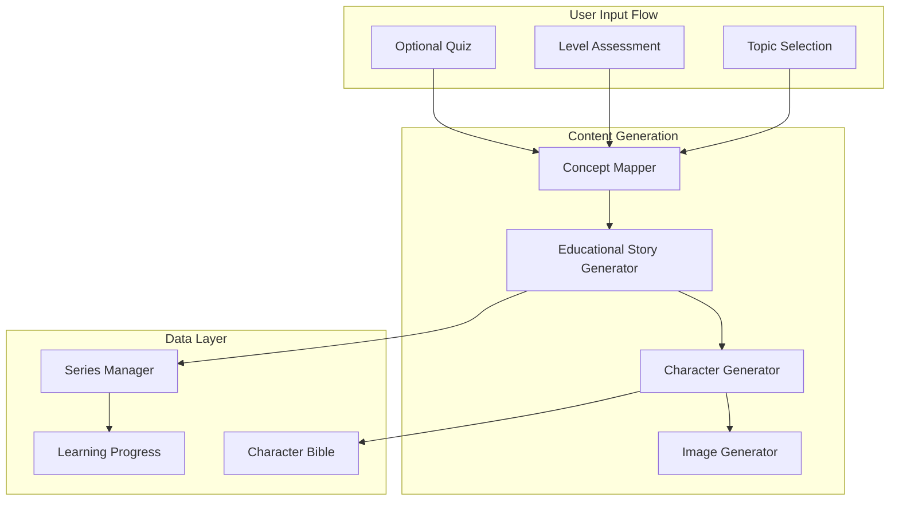

# Educational Storybooks Feature Implementation

## Overview

Extend GoldenTales backend to generate educational storybooks that teach complex topics (e.g., reinforcement learning, history, chemistry) through illustrated narratives. Content adapts to learner's level, uses hybrid characters, and supports multi-chapter series.

---

## Architecture



---

## Core Components

### 1. New Enums and Models

Add to [`app/models/enums.py`](app/models/enums.py):

- `BookType`: `CHILDREN`, `EDUCATIONAL`
- `LearningLevel`: `BEGINNER`, `INTERMEDIATE`, `ADVANCED`, `EXPERT`
- `TopicCategory`: `STEM`, `HUMANITIES`, `LANGUAGES`, `ARTS`, `BUSINESS`, `OTHER`
- `ConceptCharacterType`: `AGENT`, `ENVIRONMENT`, `PROCESS`, `ENTITY`, `GUIDE`

### 2. Database Schema Extensions

New tables needed in Alembic migration:

- `educational_topics`: Topic metadata, prerequisites, difficulty mapping
- `learning_series`: Series metadata, chapter order, concept progression
- `series_chapters`: Individual chapter entries with position and continuity data
- `concept_characters`: Conceptual character definitions (e.g., "Agent Alpha" for RL)
- `learner_profiles`: Learner level assessment, quiz results, progress tracking
- `series_character_bibles`: Character consistency data that persists across a series

### 3. Level Assessment Service

New service: [`app/services/level_assessment_service.py`](app/services/level_assessment_service.py)

- **Self-Report Input**: Accept beginner/intermediate/advanced selection
- **Quiz Generation**: Use Gemini to generate 3-5 topic-specific questions
- **Level Calibration**: Combine self-report + quiz results to determine effective level
- **Response**: Return calibrated `LearningLevel` with confidence score

### 4. Educational Story Generator

New service: [`app/services/educational_story_generator.py`](app/services/educational_story_generator.py)

Key differences from current `StoryGenerator`:

- **Pedagogical Structure**: Setup (context) → Core Concepts → Application → Reinforcement → Summary
- **Concept Integration**: Break topic into digestible concepts, introduce progressively
- **Age Adaptation**: Adjust vocabulary, metaphors, and examples based on age/level
- **Hybrid Characters**: Main learner + concept characters that personify abstract ideas
- **Series Awareness**: Track what was taught in previous chapters

Example prompt structure:

```
EDUCATIONAL STORY GENERATION
Topic: {{ topic }} (e.g., "Reinforcement Learning")
Level: {{ level }} (e.g., "Intermediate")
Chapter: {{ chapter_number }} of {{ total_chapters }}
Previous Concepts Covered: {{ previous_concepts }}
This Chapter's Focus: {{ current_concepts }}

LEARNER CHARACTER: {{ learner_character_bible }}
CONCEPT CHARACTERS:
- {{ concept_char_1 }} (represents: {{ concept_1 }})
- {{ concept_char_2 }} (represents: {{ concept_2 }})

Generate a {{ page_count }}-page story that teaches {{ current_concepts }}...
```

### 5. Concept Character System

New service: [`app/services/concept_character_service.py`](app/services/concept_character_service.py)

- **Concept Personification**: Transform abstract concepts into characters
  - Example: "Reward Signal" → "Rewardy the Oracle" (for RL)
  - Example: "Photosynthesis" → "Sunny the Leaf" (for biology)
- **Visual Consistency**: Generate character bible for each concept character
- **Series Persistence**: Same concept character appearance across chapters
- **Role Templates**: Agent, Environment, Process, Entity, Guide archetypes

### 6. Series Manager

New service: [`app/services/series_manager.py`](app/services/series_manager.py)

- **Series Creation**: Create a new learning series with topic, chapters, progression
- **Chapter Tracking**: Track which concepts have been covered
- **Continuity Data**: Store character bibles, art style, recurring elements
- **Next Chapter Generation**: Context-aware continuation with references to previous chapters

### 7. New API Endpoints

New router: [`app/routers/v2/education.py`](app/routers/v2/education.py)

| Endpoint | Method | Description |

|----------|--------|-------------|

| `/education/topics` | GET | List available topic categories |

| `/education/assess` | POST | Submit level assessment (self-report + optional quiz) |

| `/education/quiz/{topic}` | GET | Get quiz questions for a topic |

| `/education/series` | POST | Create a new learning series |

| `/education/series/{id}` | GET | Get series details and progress |

| `/education/series/{id}/chapters` | POST | Generate next chapter |

| `/education/preview` | POST | Generate quick preview (like kids flow) |

### 8. Request/Response Models

New models in [`app/models/requests.py`](app/models/requests.py):

```python
class LevelAssessmentRequest(BaseModel):
    topic: str
    topic_category: TopicCategory
    self_reported_level: LearningLevel
    quiz_answers: Optional[List[QuizAnswer]] = None

class CreateEducationalSeriesRequest(BaseModel):
    topic: str
    topic_category: TopicCategory
    learner_level: LearningLevel
    target_chapters: int = 5
    learner_name: str
    learner_age_band: str  # "child", "teen", "adult"
    art_style: ArtStyle
    include_quiz_between_chapters: bool = False

class GenerateChapterRequest(BaseModel):
    series_id: str
    chapter_number: int
    custom_focus: Optional[str] = None  # Override default concept progression
```

---

## Key Files to Create

| File | Purpose |

|------|---------|

| `app/services/level_assessment_service.py` | Level assessment with quiz generation |

| `app/services/educational_story_generator.py` | Educational story generation with pedagogy |

| `app/services/concept_character_service.py` | Concept personification into characters |

| `app/services/series_manager.py` | Multi-chapter series management |

| `app/routers/v2/education.py` | API endpoints for educational books |

| `alembic/versions/002_educational_schema.py` | Database schema for educational features |

## Key Files to Modify

| File | Changes |

|------|---------|

| `app/models/enums.py` | Add `BookType`, `LearningLevel`, `TopicCategory`, `ConceptCharacterType` |

| `app/models/requests.py` | Add educational request models |

| `app/models/responses.py` | Add educational response models |

| `character_system.py` | Add `ConceptCharacter` model alongside `AdditionalCharacter` |

| `app/config/prompt_config.py` | Add educational prompt templates |

---

## Character Consistency Strategy

### Within a Single Story

- Use existing `character_bible` approach with the learner character
- Each concept character gets its own bible entry
- All characters referenced in every image prompt

### Across Series (Between Stories)

- Store series-level character bible in `series_character_bibles` table
- Include "Previously on..." recap at chapter start
- Maintain same seed offsets for consistent rendering
- Track visual traits: colors, shapes, accessories for concept characters

---

## Example User Flow

1. User selects topic: "Reinforcement Learning"
2. User self-reports level: "Beginner"
3. Optional: User takes 5-question quiz → calibrated to "Beginner+"
4. System creates series with 5 chapters:

   - Ch1: What is an Agent?
   - Ch2: Environments and States
   - Ch3: Actions and Rewards
   - Ch4: Learning from Experience
   - Ch5: Putting It All Together

5. User provides learner character details (name, appearance)
6. System generates Ch1 with:

   - Learner character "Alex"
   - Guide character "Professor Pi"
   - Concept character "Agent Alpha"

7. User can continue to Ch2 (with continuity from Ch1)