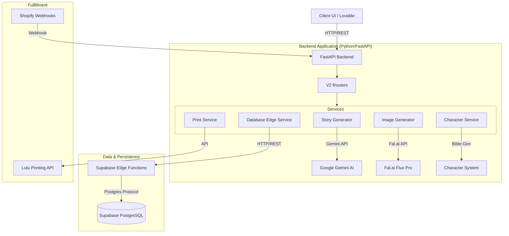

# GoldenTales Architecture

**Version**: 2.0 (V2 Architecture)
**Last Updated**: December 2024

## Overview

GoldenTales is a personalized children's book generation platform driven by AI. The system generates unique stories and consistent character illustrations based on user inputs (child's details, themes).

The architecture follows a **Headless Service-Oriented** pattern with a strict **Edge Function Gateway** for all database persistence.

---

## 🏗 System Components

### 1. API Layer (FastAPI)
The backend is built with **FastAPI** and exposed via two main version paths:
- **/api/v2/**: The current, production-ready implementation. Supports persistent storage, tiered book generation (Basic/Premium/Ultra), and robust error handling.
- **/api/v1/** (Legacy): In-memory implementation. **Deprecated**.

**Key Routers:**
- `books.py` (V2): Handles book creation, retrieval, and page regeneration.
- `orders.py`: Manages order creation and fulfillment status.
- `shopify.py`: Handles e-commerce webhooks (order created, paid).

### 2. Service Layer
Business logic is encapsulated in dedicated services:

| Service | Responsibility | Key Dependencies |
|---------|----------------|------------------|
| **StoryGenerator** | Generates 10-page text & scene descriptions using Gemini 2.0 Flash. | Google Gemini |
| **ImageGenerator** | Generates illustrations. Uses `fal-ai/flux-pro` for high quality and `fal-ai/flux/schnell` for previews. | Fal.ai |
| **CharacterService** | Creates "Character Bibles" - consistent text descriptions ensuring character identity across generated images. | `character_system.py` |
| **DatabaseEdgeService** | The **ONLY** path for database writes/reads. Calls Supabase Edge Functions. | `EdgeFunctionClient` |
| **PrintService** | Orchestrates PDF generation (CMYK, Bleed) and uploads to Lulu. | ReportLab, Lulu API |

### 3. Edge Function Gateway (Critical)
To ensure security and scalability, the backend **does not connect directly to the database**. All data operations are routed through Supabase Edge Functions.

**Pattern:**
`Backend Service` -> `HTTP Request (w/ API Key)` -> `Edge Function` -> `Supabase DB`

**Available Functions:**
- `create-story`, `get-story`, `update-story`
- `create-page`, `get-pages`
- `create-order`, `get-order`

### 4. AI & Character Consistency
The core value proposition is **Character Consistency**.
- **Character Bible**: A detailed text prompt generated *once* at creation time.
- **Prompt Engineering**: The `CharacterDescriptionGenerator` injects specific physical traits (hair style, clothing, accessories) into *every* image prompt.
- **Reference Images** (Ultra Tier): Analysis of user-uploaded photos via Gemini Vision to generate the description.

---

## 🗄 Data Model

The database schema (PostgreSQL) supports the book generation lifecycle.

### Stories Table (`stories`)
Represents a single book project.
- `id`: UUID
- `tier`: 'basic', 'premium', 'ultra'
- `status`: 'generating', 'preview', 'completed', 'failed'
- `character_bible`: JSONB (The source of truth for character consistency)
- `child_name`, `theme`, `art_style`...

### Pages Table (`pages`)
Individual pages of the story.
- `story_id`: FK to stories
- `page_number`: 1-10
- `text_content`: Story text
- `image_prompt`: Full prompt used for generation
- `image_url`: URL of the generated illustration

### Orders Table (`orders`)
Sales and fulfillment tracking.
- `shopify_order_id`: External reference
- `fulfillment_status`: 'pending', 'processing', 'shipped'

---

## 🚀 Deployment & Infrastructure

- **Backend**: Hosted on cloud provider (e.g. Render/Fly.io) running Docker.
- **Database**: Supabase (Managed PostgreSQL).
- **Edge Functions**: Deno-based functions hosted on Supabase Edge Network.
- **Storage**: Supabase Storage for PDF assets; Fal.ai for transient generated images.

## 🔐 Security

- **Authentication**: API Keys (`X-API-Key`) for backend access.
- **Webhook Verification**: HMAC-SHA256 signature verification for Shopify webhooks.
- **Content Safety**: Input sanitization and keyword blocking to prevent generation of inappropriate content.
